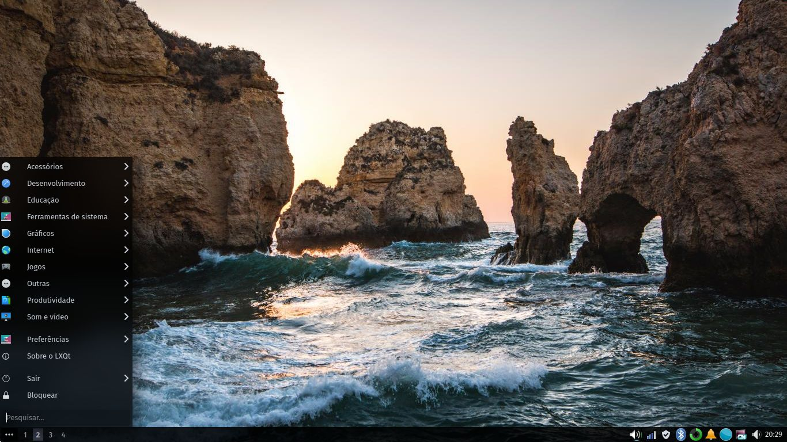

# DARK theme for LXQT

Based on [arc-dark](https://gitlab.com/isseigx/lxqt-arc-dark-theme/) but with darker colors and a more minimalistic take. This theme is meant to be used with [compton-tryone](https://github.com/tryone144/compton) or any other compositor that supports blur for full _bling_ effect.

## Bug-reports and pull-requests
These are much appreciated. Feel free to contribute to this theme :)

